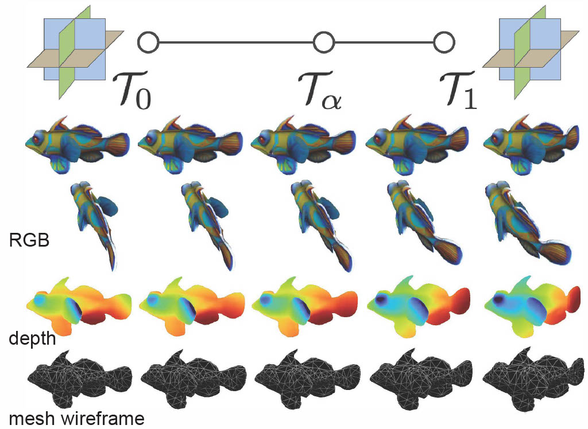

Website for the **CVPR 2025** paper:

**LIM: Large Interpolator Model for Dynamic Reconstruction.**

[Remy Sabathier](https://profiles.ucl.ac.uk/96179-remy-sabathier)1,2,
[Niloy J. Mitra](http://www0.cs.ucl.ac.uk/staff/n.mitra/)2,
[David Novotny](https://d-novotny.github.io/)1,

1Meta London, 2University College London (UCL)

| [**Project Page**](https://remysabathier.github.io/lim.github.io/) | [**ArXiv**](https://arxiv.org/abs/2503.22537) |
